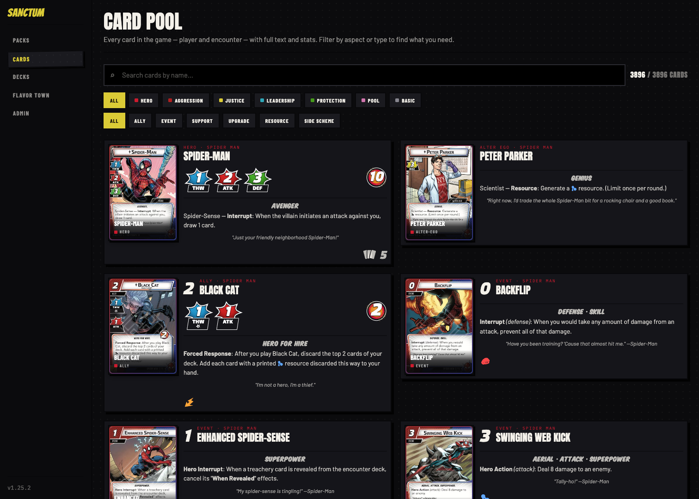
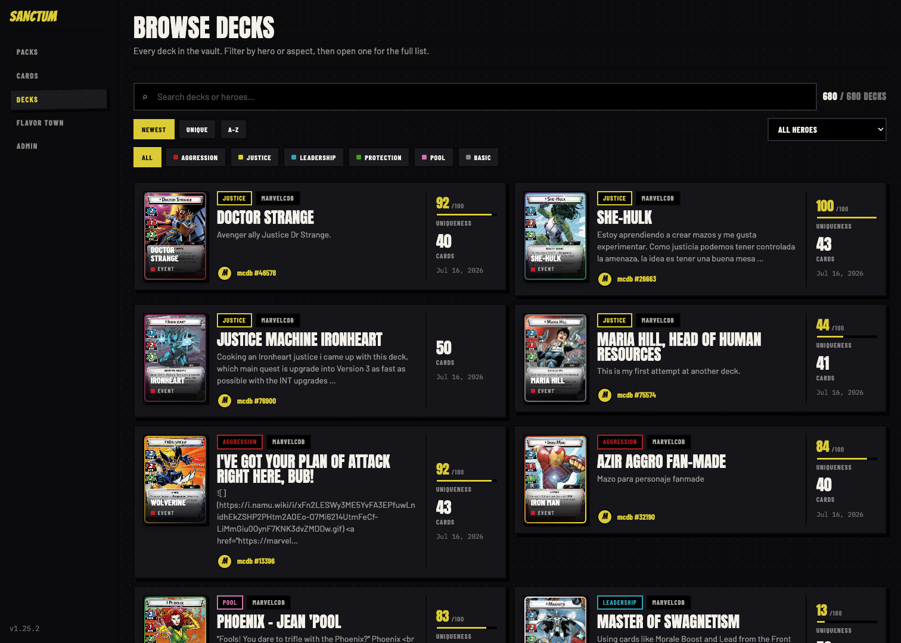
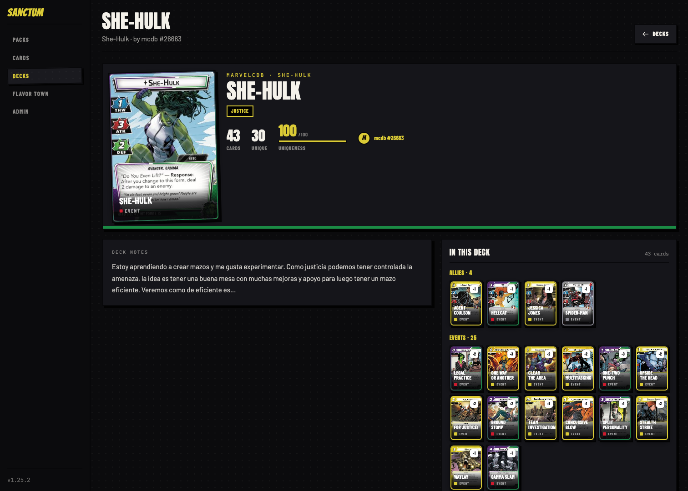
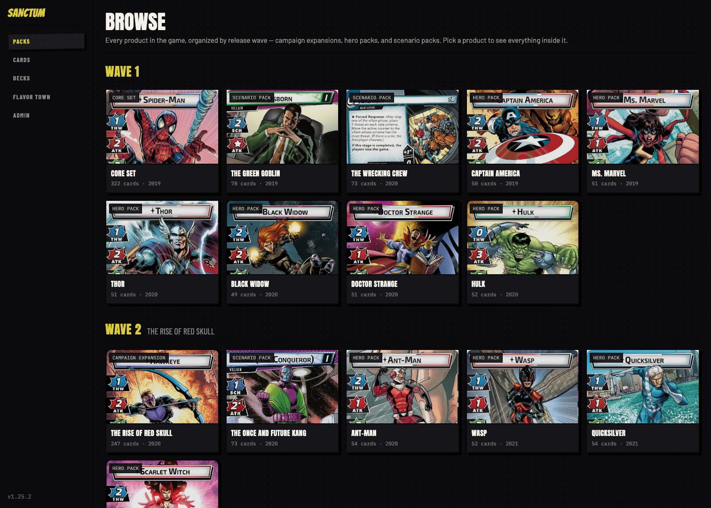
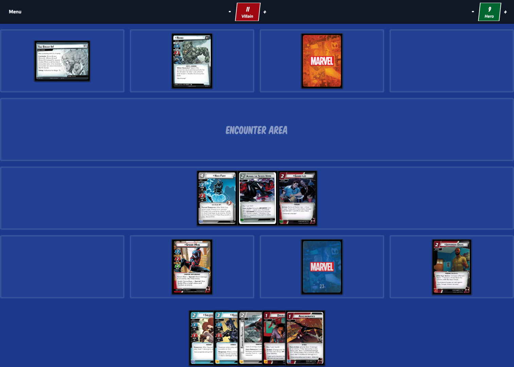

# Sanctum

[](https://github.com/jwstover/sanctum/actions/workflows/ci.yml)
[](https://github.com/jwstover/sanctum/actions/workflows/fly-deploy.yml)
[](https://github.com/jwstover/sanctum/tags)
[](https://sanctum.fly.dev)

A card library and deck explorer for [Marvel Champions: The Card Game](https://www.fantasyflightgames.com/en/products/marvel-champions-the-card-game/). Sanctum gives the full catalog — every card, pack, and hero — a fast, browsable home, alongside thousands of community decklists imported from MarvelCDB. It's also growing a "smart table" for playing online: digital bookkeeping for zones, tokens, and card states, while you and your friends enforce the rules, just like at a real table.

Sanctum runs live at **[sanctum.fly.dev](https://sanctum.fly.dev)**.



## What it does

- **Card library** — browse every card in the game, player and encounter, with full text, structured stats, and printed card scans. Filter by aspect and card type, search by name. The catalog (3,500+ cards) syncs from [MarvelCDB](https://marvelcdb.com).
- **Pack browser** — every product organized by release wave: campaign expansions, hero packs, and scenario packs, with a peek at everything inside.
- **Deck browser** — decklists imported from MarvelCDB, filterable by hero and aspect, each scored with a *uniqueness* rating that surfaces off-meta brews over netdecks.
- **Game table** *(work in progress)* — a live, shared table with villain/scheme rows, an encounter area, player boards, and hand management. State lives in Postgres and syncs to every connected client over Phoenix PubSub. No rules engine — players make the plays, Sanctum keeps the state.

### Deck browser



Open a deck for the full list, deck notes, and a card-by-card breakdown by type:



### Pack browser



### Game table (early days)



## How it's built

| | |
|---|---|
| Language / framework | Elixir · Phoenix LiveView |
| Data layer | [Ash Framework](https://ash-hq.org) resources on PostgreSQL |
| Real-time | Phoenix PubSub |
| Background jobs | Oban + AshOban |
| Frontend | LiveView + Tailwind, custom JS hooks, self-hosted fonts |
| Auth | Google OAuth (via AshAuthentication) |
| Deploy | Fly.io · card images on a public Tigris S3 bucket |

A few deliberate architecture choices:

- **The database is the game server.** There is no GenServer-per-game or in-memory game process — games are plain Ash resources in Postgres, mutated directly by LiveViews and broadcast to connected clients via PubSub.
- **No rules enforcement.** Sanctum is a smart table, not a rules engine. It tracks zones, counters, statuses, and decks; players enforce the game rules themselves.
- **Normalized card model.** MarvelCDB's card data is reshaped into `Card` / `CardSide` / `CardAlt` resources with structured jsonb stats, a clean ownership/aspect split, and reprints collapsed into alt printings. See [`docs/card_fields.md`](docs/card_fields.md) and [`docs/card_model_v2.md`](docs/card_model_v2.md).

## Running it locally

You'll need Elixir 1.18+ / Erlang 28 (see [`.tool-versions`](.tool-versions)) and PostgreSQL. A `docker-compose.yml` is included if you'd rather run Postgres in a container:

```bash
docker compose up -d postgres
```

Then:

```bash
mix setup                  # deps, database, assets (seeds the core set)
iex -S mix phx.server      # dev server on http://localhost:4150
```

The dev server runs on port **4150**, not Phoenix's usual 4000.

Seeding gives you the core set only. To pull the full catalog and some decklists from MarvelCDB:

```bash
mix sanctum.sync_cards     # full card catalog
mix sanctum.sync_decks     # decklists
```

Sign-in is Google OAuth, so you'll need Google client credentials (`GOOGLE_CLIENT_ID` / `GOOGLE_CLIENT_SECRET`) in your environment. To reach the admin surfaces (`/admin`), promote your account after first sign-in:

```elixir
Sanctum.Release.promote_admin("you@example.com")
```

### Development commands

```bash
mix test                   # test suite
mix ck                     # format + Credo + Sobelow (run before committing)
mix dialyzer               # static analysis
mix ash.codegen <name>     # generate migrations after resource changes
```

## Acknowledgements

- Card data and decklists come from [MarvelCDB](https://marvelcdb.com) — thanks to that community for the API and years of curation.
- Marvel Champions: The Card Game is © Fantasy Flight Games / Marvel. Card images and game content are the property of their respective owners. Sanctum is an unofficial fan project, is not produced or endorsed by FFG or Marvel, and is built for personal, non-commercial use.
